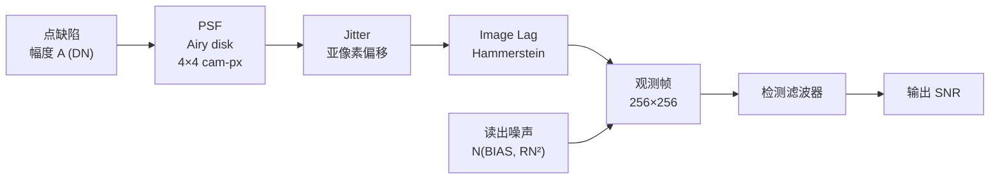
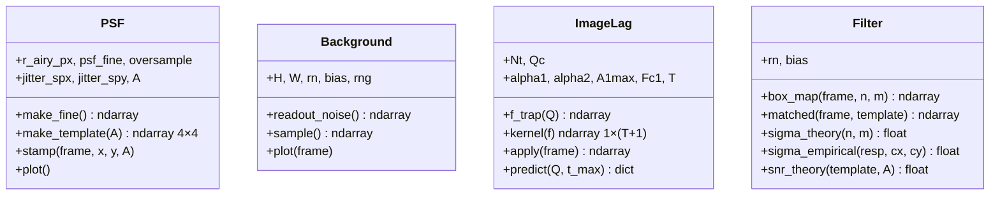
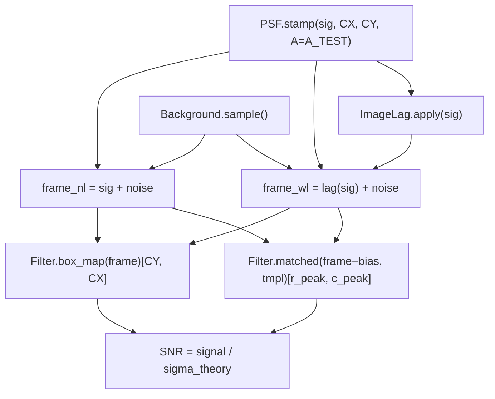
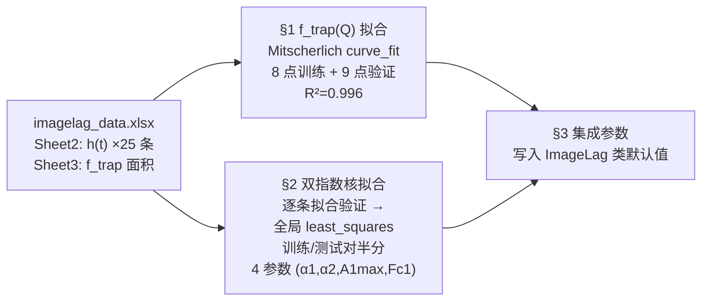

# ZP8 Image Lag Detection — 系统与软件框架

#ZP8 #image-lag #detection #matched-filter

---

## 1. 目标

从相机帧序列中检测点缺陷。缺陷除了产生正常 PSF 响应，还因 **charge-trapping image lag** 在后续帧留下拖尾。利用这个拖尾做**匹配滤波（MF）**，可以提高 SNR。

---

## 2. 系统架构（信号链）



### 2.1 各环节参数

| 环节 | 关键参数 | 默认值 |
|------|----------|--------|
| PSF | Airy r_airy=1 cam-px，128×128 fine grid，OVERSAMPLE=32 | — |
| Jitter | `jitter_spx / spy`（fine px） | 0–10 |
| Image Lag | Nt, Qc, α1, α2, A1max, Fc1 | 见 §4 |
| 读出噪声 | RN, BIAS | 1.2 DN, 10 DN |
| 帧大小 | H×W | 256×256 |

---

## 3. Image Lag 物理模型（Hammerstein）

### 3.1 完整公式

$$
r(t;\,Q) = \underbrace{[Q - f_{\rm trap}(Q)] \cdot \delta(t=0)}_{\text{当帧剩余}} + \underbrace{f_{\rm trap}(Q) \cdot h(t;\,f_{\rm trap})}_{\text{拖尾 lag}}
$$

### 3.2 静态非线性 f_trap(Q)

$$
f_{\rm trap}(Q) = N_t \left(1 - e^{-Q/Q_c}\right) \quad \text{(Mitscherlich)}
$$

- 低信号线性区：$f_{\rm trap} \approx (N_t/Q_c)\cdot Q \approx 0.73\,Q$（约 73% 被捕获）
- 高信号趋向饱和：最大捕获 $N_t \approx 62.6$ DN

### 3.3 Q 依赖双指数释放核 h(t; F)

$$
h(t;\,F) = A_1(F)\cdot g_{\rm fast}(t) + [1 - A_1(F)]\cdot g_{\rm slow}(t)
$$

$$
A_1(F) = A_{\rm 1max}\left(1 - e^{-F/F_{c1}}\right)
$$

其中 $g_{\rm slow/fast}$ 为归一化单指数衰减：

$$
g(t;\,\alpha) = \frac{(1-\alpha)\,\alpha^t}{\sum_{t=1}^{T}(1-\alpha)\,\alpha^t}
$$

> [!info] 物理图像（水桶比喻）
> - Q = 倒进桶的水量（输入信号）
> - Nt = 桶容量（陷阱总数）
> - f_trap(Q) = 桶里存住的水（被俘获电荷）
> - h(t;F) = 漏水节奏（随信号强度变化）

---

## 4. 标定参数

来源：`lag_model_fit_test.ipynb`

| 参数 | 值 | 含义 |
|------|----|------|
| `Nt` | 62.63 DN | 陷阱容量上限 |
| `Qc` | 85.4 DN | 半饱和信号 |
| `α1` | 0.7779 | 慢陷阱衰减，τ₁ ≈ 3.98 帧 |
| `α2` | 0.2344 | 快陷阱衰减，τ₂ ≈ 0.69 帧 |
| `A1max` | 1.0 | 最大快陷阱占比 |
| `Fc1` | 78.5 DN | 快慢陷阱权重转折（A1=50% 处） |
| `T` | 20 帧 | 拖尾窗口长度 |

**拟合精度：** f_trap R²=0.996；核全局优化 Train RMS ≈ Test RMS（未过拟合）

---

## 5. 检测滤波器

### 5.1 理论 SNR

对模板 $\mathbf{h}$（单位能量）、信号 $\mathbf{s}$、白噪声 $\sigma = RN$：

$$
\text{SNR}_{\rm MF} = \frac{\mathbf{h}^{\mathsf T}\mathbf{s}}{RN} = \frac{\|\mathbf{s}\|}{RN} \quad \text{（当 } \mathbf{h} = \mathbf{s}/\|\mathbf{s}\|\text{）}
$$

### 5.2 各滤波器对比

| 滤波器 | 模板 | 理论 σ | 状态 |
|--------|------|--------|------|
| **Box n×m** | 全1均匀核 | `RN·√(n·m)` | ✅ 完成 |
| **MF-PSF** | 4×4 PSF 形状 | `RN` | ✅ 完成 |
| **MF-lag** | PSF+lag 完整响应 | `RN` | ✅ 完成 |
| Wiener | `C⁻¹h`（clutter 匹配） | — | TODO |
| GLRT | `hᵀC⁻¹x`（未知幅度） | — | TODO |

### 5.3 SNR 测量方法（正确做法）

```
signal = filter(clean_signal)[anchor]    ← 无噪声干净信号在已知锚点
noise  = sigma_theory
       = RN · sqrt(n·m)                  ← box
       = RN                              ← MF（单位能量模板）
SNR    = signal / noise
```

> [!warning] 常见错误
> - 用 `.max()` 取信号：低 SNR（A=20 DN）时，65536 像素噪声期望最大值 ≈ RN×4.7 ≈ 5.6 DN，大于信号 ≈ 5 DN，max 返回噪声峰
> - 非对称 lag 模板的 `fftconvolve` 峰位 ≠ (CY, CX)，需按模板尺寸计算锚点：
>   `c_peak = c0 + h_c - 1 - (h_c-1)//2`
> - 模板已在 A_TEST 幅度下建立，SNR 公式为 `‖tmpl‖/RN`，不是 `A×‖tmpl‖/RN`

---

## 6. 软件框架

### 6.1 文件结构

```
ZP8_algo_lab/
├── imagelag_filter.ipynb            # 主仿真：PSF/Lag/Filter 类 + 滤波器对比
├── lag_model_fit_test.ipynb         # 参数拟合：f_trap + 双指数核全局优化
├── imagelag_data.xlsx               # 实测数据 Sheet2=h(t)  Sheet3=f_trap 面积
├── image_lag_validation_report.md   # 单物种 Hammerstein 验证报告
├── lag_model_fit.py                 # 早期单物种拟合（存档）
└── CLAUDE.md                        # 项目指引
```

### 6.2 类结构（imagelag_filter.ipynb）



### 6.3 关键数据流



### 6.4 MF 模板构建

```python
# 在 A_TEST 幅度下建模板（保留非线性信息）
sig_tmpl = zeros(H, W)
PSF(A=A_TEST).stamp(sig_tmpl, CX, CY)
lr = ImageLag.apply(sig_tmpl)         # 完整 PSF+lag 响应

# 裁剪：4 行（PSF 高度）× (4+LAG_COLS) 列
r0, r1 = CY-2, CY+2
c0, c1 = CX-2, CX+2+LAG_COLS
tmpl_lag = lr[r0:r1, c0:c1]

# fftconvolve 'same' 峰位（非对称模板，行=CY，列右偏）
h_r, h_c = tmpl_lag.shape
r_peak = CY
c_peak = (CX-2) + h_c - 1 - (h_c-1)//2
```

### 6.5 参数拟合流程（lag_model_fit_test.ipynb）



---

## 7. TODO

- [ ] **理论 SNR cell**：干净信号，各滤波器在锚点的精确信号量
- [ ] **Monte Carlo 验证**：多次噪声重复，均值 ≈ 理论信号，std ≈ σ_th
- [ ] **Wiener 滤波器**：`g = S_s/(S_s+S_n)` 频域，lag 尾作有色噪声
- [ ] **GLRT**：未知幅度 A 的广义似然比检验，`hᵀC⁻¹x`
- [ ] **SNR vs A 蒙卡扫描**：A=10~200 DN 各滤波器均值±std 曲线
- [ ] **f(Q) 双指数扩展**：试 `N₁(1-e^{-Q/Q₁}) + N₂(1-e^{-Q/Q₂})`
- [ ] **补拐点区采样**（60–140 DN）压低 Qc 不确定度

---

**相关文件**
- [[image_lag_validation_report]] — 单物种 Hammerstein 验证（三组实测）
- `imagelag_filter.ipynb` — 主仿真代码
- `lag_model_fit_test.ipynb` — 参数拟合代码
- `imagelag_data.xlsx` — 原始实测数据
